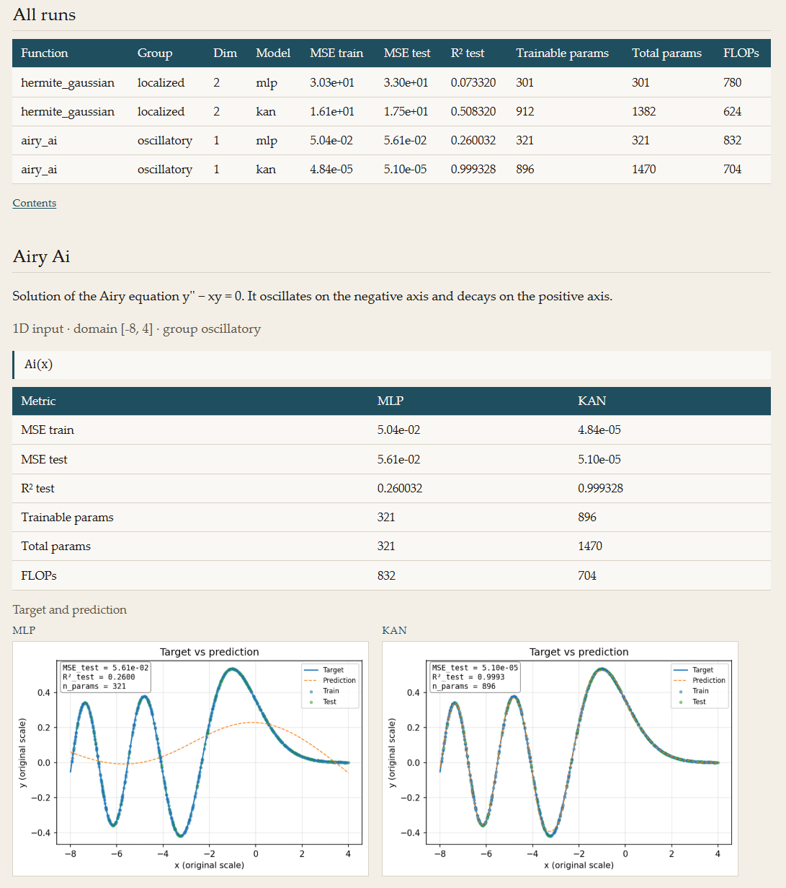
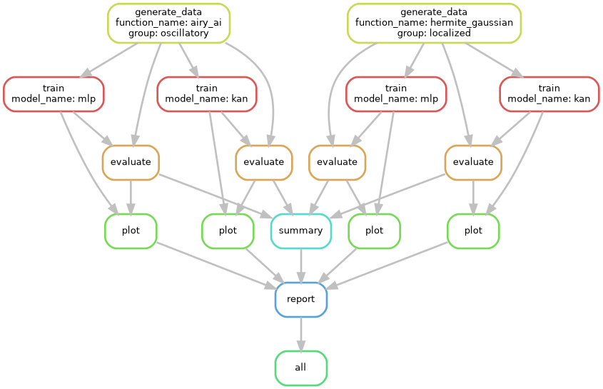
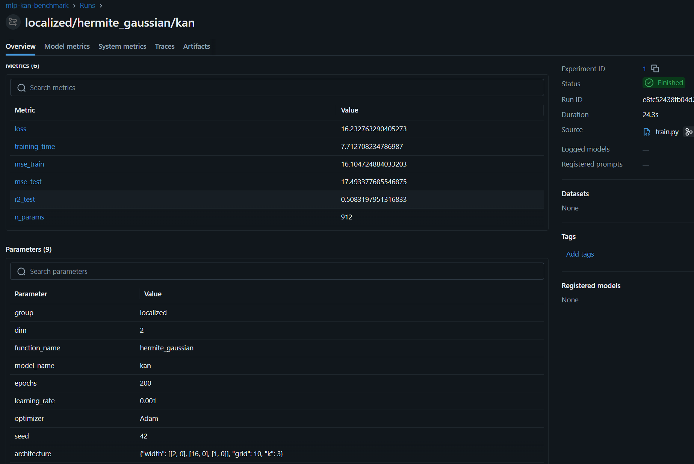

# MLP vs KAN | Reproducible Neural Network Benchmarking

A compact **PyTorch benchmark for synthetic regression**: train a multilayer perceptron (MLP) and a Kolmogorov–Arnold Network (KAN, via `pykan`) on the same mathematical targets, orchestrate the workflow with **Snakemake**, track runs with **MLflow**, and explore the results in a generated HTML report.

### [Explore the HTML benchmark report →](https://aqs-ds.github.io/mlp-kan-regression-benchmark/demo/)

[](https://aqs-ds.github.io/mlp-kan-regression-benchmark/demo/)

*The report is a static, navigable demonstration of the generated results; it does not run training or expose the local MLflow server.*

## What the benchmark demonstrates

The default [`config.yaml`](config.yaml) runs both architectures on two mathematically motivated regression targets (**four training runs**):

| Target | Domain | Mathematical structure |
| --- | --- | --- |
| **Airy Ai** (1D) | `x ∈ [-8, 4]` | Solution of `y'' − xy = 0`, oscillating on the negative axis and decaying on the positive axis. |
| **Hermite–Gaussian mode** (2D) | `(x, y) ∈ [-3, 3]²` | An unnormalized harmonic-oscillator mode, `H₃(x) H₂(y) exp(−(x²+y²)/2)`, with nodal lines and a localized envelope. |

For each target, both models share a train/test split. Target normalization, when needed, is fitted on training data only; MSE and R² are reported on the original target scale. The workflow produces predictions, loss curves, residual plots and a comparative HTML report.

**Scope:** this is an engineering and experiment-tracking demo adapted from an earlier private project, not a controlled study claiming that either model is generally superior. The defaults use a single seed and unequal model parameter budgets. Forward-pass FLOP figures use different estimation methods and should **not** be interpreted as a matched-compute comparison.

## How the pipeline works

Snakemake coordinates dataset generation, model training, evaluation, visualization and report generation. MLflow records training parameters and loss, evaluation metrics and plot artifacts under the **same run ID** for each model–target pair.



- **PyTorch / pykan:** train and evaluate the MLP and KAN in `scripts/train.py` and `scripts/evaluate.py`.
- **Snakemake:** manage dependencies and generate `results/report.html` with the rules in [`Snakefile`](Snakefile).
- **MLflow:** inspect run parameters, metrics, training history and figures in a local experiment-tracking UI.
- **Configuration:** [`config.yaml`](config.yaml) defines the targets, architectures, random seed, split and training hyperparameters. Target formulas are implemented in `scripts/utils.py`. The `report.group_by` option switches between per-target and grouped report layouts; the default is `target`.

## Run it locally

Use **Python 3.10** and run these commands from the project root:

```bash
python -m venv .venv
source .venv/bin/activate  # Windows PowerShell: .venv\Scripts\Activate.ps1
pip install -r requirements.txt
snakemake --cores 1
```

The generated report is at `results/report.html`. The published snapshot in [`docs/demo/`](docs/demo/index.html) is a separate, versioned copy and will not update automatically after a local run.

For platform-specific setup and verification, see [Environment setup](docs/setup_environment.md). After changing experiment settings or target implementations, avoid mixing new settings with cached outputs; `snakemake --cores 1 --forceall` rebuilds the configured workflow and retrains the models.

### Inspect runs in MLflow

From the project root, in a second terminal with the environment activated:

```bash
mlflow ui --backend-store-uri sqlite:///mlflow.db
```

Open the local URL printed by MLflow (typically `http://127.0.0.1:5000`). Training, evaluation and plotting write to the same local run; no remote tracking server is required.



## License

The repository's original code is released under the [MIT License](LICENSE). PyTorch, `pykan`, Snakemake, MLflow and other third-party dependencies retain their respective licenses.
